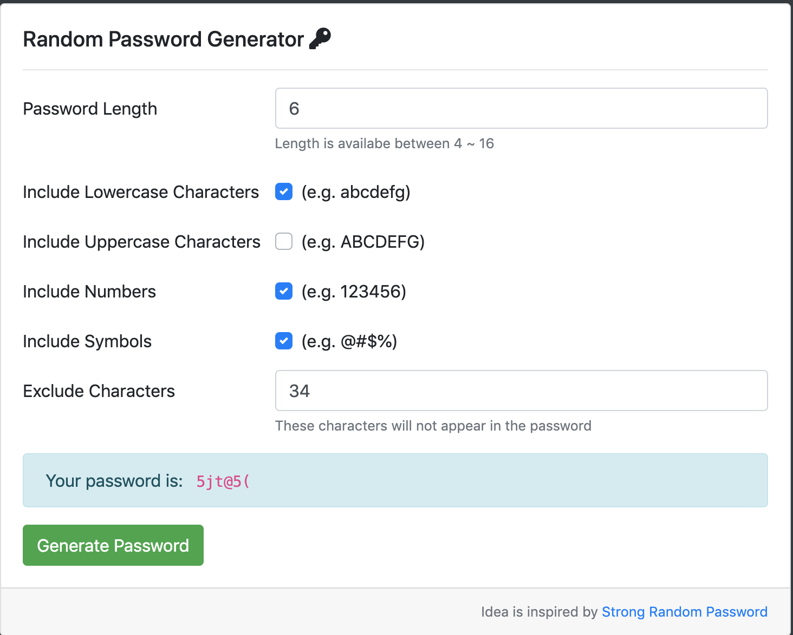

# Password Generator 密碼產生器
運用 Node.js 製作的小工具，使用者可以隨機產生一組密碼

## 環境建置與需求
* [Node.js version 10.16.0 (LTS)](https://nodejs.org/en/)
* [Express 4.17.1](https://www.npmjs.com/package/express)
* [Express-Handlebars 3.1.0](https://www.npmjs.com/package/handlebars)
* [body-parser 1.19.0](https://www.npmjs.com/package/body-parser)

## How to use? 如何使用？
1. 利用 git 或是 cmd 在目標資料夾下輸入以下指令
```
git clone https://github.com/andy922200/alphacamp.git
```
2. 打開終端機，切換到 Password_Generator 資料夾
```
cd "alphacamp/Password_Generator"
```
3. 接著，安裝相關的套件
```
npm install 
```
4. 輸入以下指令
```
npm run dev
```
最後打開瀏覽器，輸入 localhost:3000 就可開始使用

## 螢幕截圖
