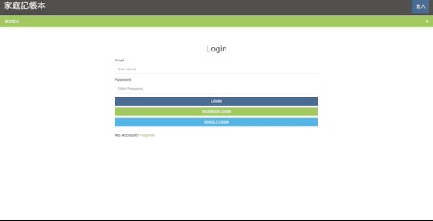

# My Expense-Tracker
# 我的開銷帳本資料庫
採用 Node.js, MySQL 製作的前後端應用程式，使用者可以隨機 建立、編輯、更新、刪除檔案，並串接 Facebook & Google & Github 方便使用者登入。

## Prerequisites 
## 環境建置與需求
* [Node.js version 10.16.0 (LTS)](https://nodejs.org/en/)
```
nvm install 10.16.0
```
* [以及一連串的套件清單，請閱讀 package.json](https://tinyurl.com/y4kfg2gg)
```
npm install
```
* [MySQL 和 Workbench 下載安裝](https://dev.mysql.com/downloads/mysql)

## How to use? 如何使用？
1. 利用 git 或是 cmd 在目標資料夾下輸入以下指令來下載專案
```
git clone https://github.com/andy922200/alphacamp.git
```
2. 切換到 expense-tracker 資料夾
```
cd "alphacamp/expense-tracker_sequelize"
```
3. 接著，安裝相關的套件
```
npm install 
```
4. 在 MySQL 創造 database
* 開啟 MySQL Workbench
* 輸入以下指令
```
drop database if exists expense_tracker_sequelize;
create database expense_tracker_sequelize;
use expense_tracker_sequelize;
```
5. 新增 Table 和 Models
```
npx sequelize db:migrate
```
6. 設立本機端 .env
* 在根目錄新增 .env
* 用文字編輯器打開，新增以下內容並儲存
```
FACEBOOK_ID= 請先到 Facebook 開發者頁面取得
FACEBOOK_SECRET= 請先到 Facebook 開發者頁面取得
FACEBOOK_CALLBACK=http://localhost:3000/auth/facebook/callback 
GOOGLE_ID= 請先到 Google 開發者頁面取得
GOOGLE_SECRET= 請先到 Google 開發者頁面取得
GOOGLE_CALLBACK=http://localhost:3000/auth/google/callback

GITHUB_CLIENT_ID= 請先到 GitHub 開發者頁面取得
GITHUB_CLIENT_SECRET= 請先到 GitHub 開發者頁面取得
GITHUB_CALLBACK=http://localhost:3000/auth/github/callback
```
7. 輸入以下指令
```
npm run dev
```
8. 打開瀏覽器，輸入 localhost:3000 即可使用
## 螢幕截圖
